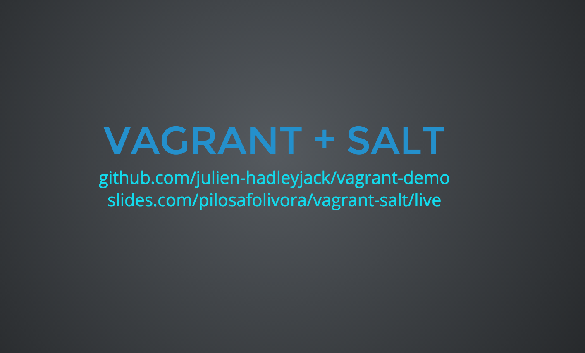

# Vagrant Demo

A demo on how to setup a simple [Flask](http://flask.pocoo.org/) application using [Vagrant](https://www.vagrantup.com/) to create reproducable development and deployment environments. [Saltstack](http://saltstack.com/) was selected as a provisioner.

## Presentation



This demo was created for the lecture "Software Engineering" at the Baden-Wuerttemberg Cooperative State University Karlsruhe. It was used combined with a presentation which can be seen [here](http://julien-hadleyjack.github.io/vagrant-demo/).

## Run Demo

To run the demo you first need to install [Vagrant](https://www.vagrantup.com/). Then you just need to run

```
vagrant up
```

in the project directory and then you can interact with the running Flask application at http://localhost:5000.